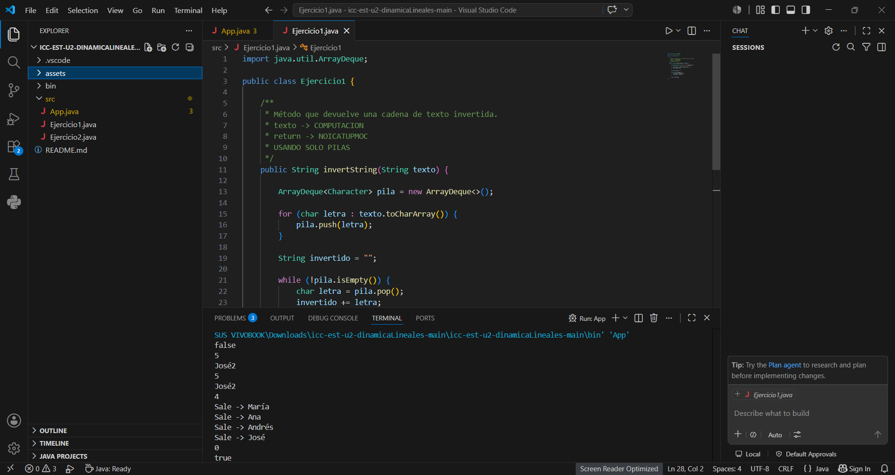
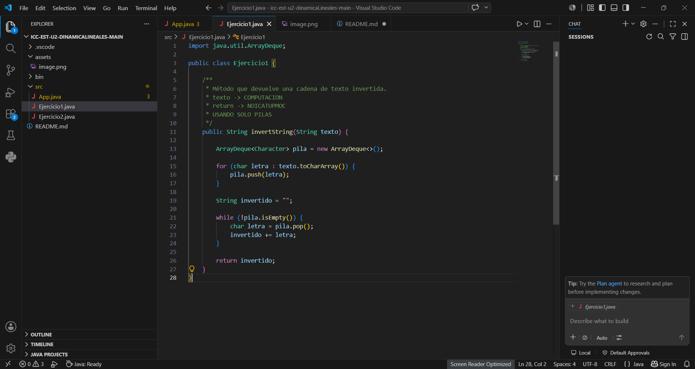

# Práctica: Estructuras Dinámicas Lineales

## Datos del Estudiante

* **Nombre:** Andrea Sagbay.
* **Curso:** De la Tarde.
* **Fecha:** 09/06/2026

---

## 1. Implementación de estructuras dinámicas lineales

**Fecha:** 09/06/2026

**Descripción:**

Se trabajó con estructuras dinámicas lineales en Java, realizando la implementación y prueba de LinkedList, Queue y Stack. A través de estas estructuras se analizaron operaciones fundamentales como la inserción, consulta, eliminación y recorrido de elementos, permitiendo comprender su comportamiento y funcionamiento práctico.

### Captura de salida en consola




### Captura del código de implementación del ejercicio 1



o bloque de código .

```java
public String invertString(String texto) {

    ArrayDeque<Character> pila = new ArrayDeque<>();

    for (int i = 0; i < texto.length(); i++) {
        pila.push(texto.charAt(i));
    }

    String invertido = "";

    while (!pila.isEmpty()) {
        invertido += pila.pop();
    }

    return invertido;
}
```

## 2. Ejercicio Palíndromo

**Fecha:** 09/06/2026

**Descripción:**

Se implementó un método que permite verificar si una palabra es palíndroma utilizando únicamente una pila. Para ello, se almacenan los caracteres en una pila, se construye el texto invertido y se compara con el texto original.

### Método implementado

```java
public boolean esPalindromo(String texto) {

    ArrayDeque<Character> pila = new ArrayDeque<>();

    for (int i = 0; i < texto.length(); i++) {
        pila.push(texto.charAt(i));
    }

    String invertido = "";

    while (!pila.isEmpty()) {
        invertido += pila.pop();
    }

    return texto.equals(invertido);
}
```
